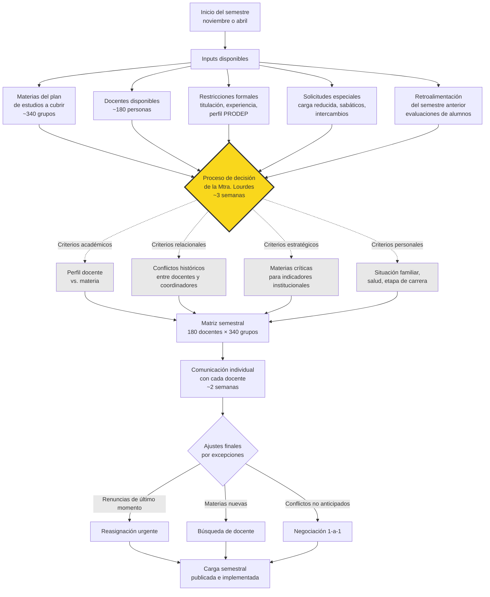

# Diagrama del proceso actual de asignación de carga académica

## Visualización del flujo

## Descripción del flujo

### Inputs (cada noviembre y abril)

El proceso inicia con la consolidación de cinco fuentes de información:

1. **Materias a cubrir** — aproximadamente 340 grupos según el plan de estudios vigente, distribuidos entre los tres campus y los dos turnos.
2. **Docentes disponibles** — los 180 docentes con su carga histórica, disponibilidad declarada y estatus contractual.
3. **Restricciones formales** — perfil de titulación requerido para cada materia, experiencia mínima, requisitos PRODEP/SEP cuando aplican.
4. **Solicitudes especiales** — peticiones de carga reducida (por estudios, salud, investigación), sabáticos programados, solicitudes de intercambio de turno.
5. **Retroalimentación del semestre anterior** — evaluaciones de alumnos, reportes de coordinadores, incidentes documentados.

### Proceso de decisión (caja negra de ~3 semanas)

La Mtra. Lourdes opera el cruce de información durante aproximadamente tres semanas. Su proceso de pensamiento no está formalmente documentado, pero cruza al menos cuatro tipos de criterios:

- **Criterios académicos.** Perfil docente versus exigencia de la materia.
- **Criterios relacionales.** Conflictos históricos entre docentes y coordinadores, dinámicas de academia, antipatías documentadas o conocidas.
- **Criterios estratégicos.** Materias críticas para indicadores institucionales (ej. índices de reprobación monitoreados por dirección general).
- **Criterios personales.** Situación familiar, salud, etapa de carrera profesional del docente.

Los criterios académicos y formales pueden codificarse. Los relacionales y personales operan en un espacio que la Mtra. Lourdes maneja desde su memoria y su relación de 16 años con el cuerpo docente.

### Output inicial

Matriz semestral de aproximadamente 180 docentes contra 340 grupos. Cada celda asigna o no a un docente a un grupo específico, con turno y campus definidos.

### Comunicación individual (~2 semanas)

Lourdes comunica personalmente la asignación a cada docente. Esta etapa no es ceremonial: es donde surgen ajustes finos, renegociaciones y descubrimientos de incompatibilidades no anticipadas.

### Ajustes finales por excepciones

Tres tipos comunes de excepciones que requieren intervención adicional:

- **Renuncias de último momento** — docentes que dejan la institución después de publicada la asignación inicial.
- **Materias nuevas** — adecuaciones de plan de estudios o materias optativas con demanda no anticipada.
- **Conflictos no anticipados** — choques de horario, restricciones personales no comunicadas previamente, cambios en coordinaciones.

### Implementación final

Carga semestral publicada oficialmente e implementada al inicio del semestre lectivo.
